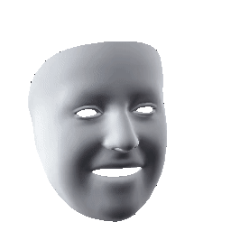

# [DiFaReli](https://diffusion-face-relighting.github.io/): Diffusion Face Relighting (ICCV 2023)
Puntawat Ponglertnapakorn, Nontawat Tritrong, [Supasorn Suwajanakorn](https://www.supasorn.com/)

## Overview

This repository contains:

1. Preprocessing for any images
2. Script for training and inference

## Dependencies

## Quick start
1. Install
1. Pre
2. Create

## Preprocessing

1. Create the folder
1. Align images
python align.py -i ../test_images/images/valid -o ../test_images/images/aligned_images/valid

## Inference
### Relighting  {: width="50%"}
python ./reduce_steps/relight_idx_supmat_reduce_step.py --dataset ffhq --set valid --step 085000 --out_dir /data/mint/sampling/test_release --cfg_name Masked_Face_woclip+BgNoHead+shadow_256.yaml --log_dir Masked_Face_woclip+BgNoHead+shadow_256 --diffusion_steps 1000 --timestep_respacing 1000 --seed 47 --sample_pair_json ./reduce_steps/sample.json --sample_pair_mode pair --itp render_face --itp_step 5 --batch_size 1 --gpu_id 0 --lerp --idx 0 10

### Reshadow
1. Reshadow using arbitrary 'c' value
python relight_idx_shadow.py --dataset ffhq --set valid --step 085000 --out_dir /data/mint/sampling/Generated_reshadow_-5to10 --cfg_name Masked_Face_woclip+BgNoHead+shadow_256.yaml --log_dir Masked_Face_woclip+BgNoHead+shadow_256 --diffusion_steps 1000 --seed 47 --sample_pair_json ./sample_json/generated_data/gen_data_80perc_trainset.json --sample_pair_mode pair --itp shadow --itp_step 10 --batch_size 10 --gpu_id 2 --lerp --save_vid --idx 0 24 --vary_shadow_range -5 10

2. Reshadow 
python relight_idx_shadow.py --dataset ffhq --set valid --step 085000 --out_dir /data/mint/sampling/ProjectPage/Shadow --cfg_name Masked_Face_woclip+BgNoHead+shadow_256.yaml --log_dir Masked_Face_woclip+BgNoHead+shadow_256 --diffusion_steps 1000 --sample_pair_json ./sample_json/website/shadow_app_fig.json --sample_pair_mode pair --itp shadow --itp_step 16 --batch_size 10 --gpu_id 1 --lerp --save_vid --idx 0 1  --vary_shadow
